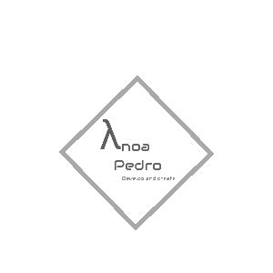

  

<a> Come find me @: </a>&nbsp;&nbsp;
  
<a href="https://twitter.com/intent/follow?screen_name=ypedrolm"></img>

<a href="https://img.shields.io/github/followers/ypedroo?style=social"></img>

<a href="https://img.shields.io/badge/-LinkedIn-blue?style=flat-square&logo=Linkedin&logoColor=white&link=https://www.linkedin.com/in/ynoapedro)">

### Hi there, I'm Ynoa:panda_face:

- 🔭 I’m currently working @[QWKIN, LLC.](https://qwkin.com/)
- 🌱 I’m currently learning and working with Node.js, .NET Core and React.
- :scream_cat: Feel free to reach out to me for anything tech, coffe, brew or cats related 
- :dancers: Also looking for cool projectos to join and help.
- 😄 Pronouns: he/him/his

Icons made by <a href="https://www.flaticon.com/authors/pixel-perfect" title="Pixel perfect">Pixel perfect</a> from <a href="https://www.flaticon.com/" title="Flaticon"> www.flaticon.com</a>
